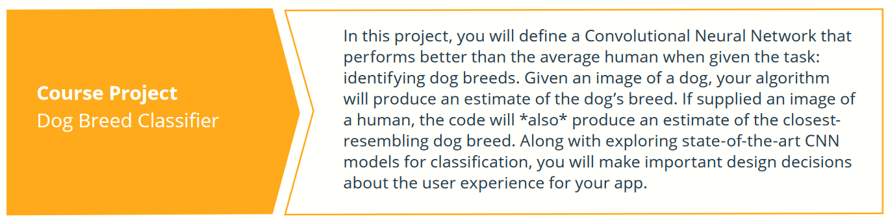

# Deep Learning Nanodegree Program

[Certifcate](https://graduation.udacity.com/confirm/CW3XRADY)
[Syllabus](https://d20vrrgs8k4bvw.cloudfront.net/documents/en-US/Deep+Learning+Nanodegree+Syllabus+8-15.pdf)

## 1. Introduction to Deep Learning

  

## Course 1: Neural Networks

Learn neural networks basics, and build your first network with Python and NumPy. Use the modern deep learning framework PyTorch to build multi-layer neural networks, and analyze real data.

## Course 2: Convolutional Neural Networks

Learn how to build convolutional networks and use them to classify images (faces, melanomas, etc.) based on patterns and objects that appear in them. Use these networks to learn data compression and image denoising.

## Course 3: Recurrent Neural Networks

Build your own recurrent networks and long short-term memory networks with PyTorch; perform sentiment analysis and use recurrent networks to generate new text from TV scripts.

## Course 4: Generative Adversarial Networks

Learn to understand and implement a Deep Convolutional GAN (generative adversarial network) to generate realistic images, with Ian Goodfellow, the inventor of GANs, and Jun-Yan Zhu, the creator of CycleGANs

## Course 5: Updating a Model

In this project, you will train and deploy your own PyTorch sentiment analysis model using AmazonSageMaker on AWS. This model will be trained to do sentiment analysis on movie reviews (positive ornegative reviews). You’ll build the model, deploy it, and create a gateway for accessing this model from a website.

